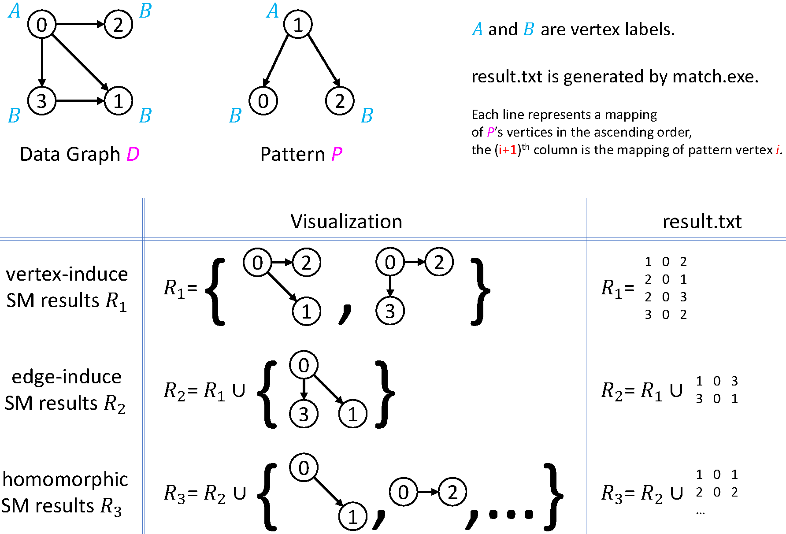

# CSCE
* Large Subgraph Matching: A Comprehensive and Efficient Approach for Heterogeneous Graphs
* If the paper or this repository help you, please consider citing the paper
* Chicago Style
```
Cao, Hongtai, Qihao Wang, Xiaodong Li, Matin Najafi, Kevin Chen–Chuan Chang, and Reynold Cheng. "Large Subgraph Matching: A Comprehensive and Efficient Approach for Heterogeneous Graphs." In 2024 IEEE 40th International Conference on Data Engineering (ICDE), pp. 2972-2985. IEEE, 2024.
```
* Bibtex
```
@inproceedings{cao2024large,
  title={Large Subgraph Matching: A Comprehensive and Efficient Approach for Heterogeneous Graphs},
  author={Cao, Hongtai and Wang, Qihao and Li, Xiaodong and Najafi, Matin and Chang, Kevin Chen--Chuan and Cheng, Reynold},
  booktitle={2024 IEEE 40th International Conference on Data Engineering (ICDE)},
  pages={2972--2985},
  year={2024},
  organization={IEEE}
}
```


## Problem Statement
* Subgraph Matching: given a small pattern graph ``P`` and a large data graph ``G``, find all subgraphs ``S`` of ``G`` such that ``S`` is isomorphic to ``P``. Below is an example.
    + 
    + Support graphs with a mixture of directed edges and undirected edges.
    + Support both labeled and unlabeled graphs. Do not allow partially labeled and partially unlabeled graphs.
    + Support all of edge-induced (non-induced), vertex-induced (induced) and homomorphic subgraph matching.
    + Subgraph matching by default refers to edge-induced subgraph matching.


## Quick Start
* This repository provides executables, example datasets, and results for subgraph matching.
    + Executables are tested on a ``Little Endian x86_64 Ubuntu 20.04.5 LTS`` machine and only work on Linux systems.
    + ``edgelist.zip`` (4GB) the dataset used in the paper.
        - useful to reproduce the experiments shown in the paper.
        - can be found at any of the following locations
            * [drive.google.com](https://drive.google.com/file/d/1DIVcRkP0dO59-IG09RSOBrMAjOLeBpMk/view?usp=sharing)
            * [weiyun.com](https://share.weiyun.com/V2ydREex)
    + ``match.exe`` writes all result subgraphs into a file given by ``-result-file file-name``, default ``result.txt``.
        - useful to find each subgraph, saved into a file.
        - Note that the result file can be huge when there are lots of results.
    + ``reproduce.exe`` produces the match result count but skips writing results to files.
        - useful to quickly find the number of result subgraphs.
    + ``unlabeled-pattern`` example patterns that can be used in subgraph matching. Below is the pattern visualization.
        - 
    + ``script`` contains script files.
    + ``result`` contains the ground truth matching results statistics, providing expected running time and the space cost.
        - To be released in Oct. 2024.
* Example
    + Find edge-induced subgraph matching results and write to file ``patents-edge-induce-dense-4-1.txt``. Expect 118088 lines, one subgraph each line. Possible total time cost 1.557 seconds.
    ```
    ./match.exe -is-labeled 1 -isomorphism EdgeInduce -data-file edgelist/patents-undirected/labeled/patents.txt -pattern-file edgelist/patents-undirected/labeled/pattern_graph/dense-4-1.txt -result-file patents-edge-induce-dense-4-1.txt
    ```
    + Skip writing to file can save sometime. Possible total time cost 0.045 seconds.
    ```
    ./reproduce.exe -is-labeled 1 -isomorphism EdgeInduce -data-file edgelist/patents-undirected/labeled/patents.txt -pattern-file edgelist/patents-undirected/labeled/pattern_graph/dense-4-1.txt
    ```


# Command Line Arguments
* Syntax
```
./match.exe -isomorphism EdgeInduce/Homomorphism/VertexInduce -is-labeled 0/1 -data-file path-to-data.txt -pattern-file path-to-pattern.txt -result-file result.txt
```
* There are 5 command line arguments, in the format of ``-argument value``.
    + ``-isomorphism``, value can be ``EdgeInduce`` or ``Homomorphism`` or ``VertexInduce``. Default ``VertexInduce``.
    + ``-is-labeled``, value can be ``1`` indicating labeled data graph and pattern, ``0`` unlabeled. Default ``1``.
    + ``-data-file``, value is the path to the data graph text file. See [Dataset Format](#dataset-format).
    + ``-pattern-file``, value is the path to the pattern text file. See [Dataset Format](#dataset-format).
    + ``-result-file``, value is file that saves result subgraph. Default ``result.txt``.


## Dataset Format
* Examples are in ``unlabeled-pattern`` or ``edgelist.zip``. See [Quick Start](#quick-start).
* Both the data graph and the pattern are text files of the same format.
* They can be either both unlabeled or both labeled. Does not allow one labeled and one unlabeled.
* Labeled graph format
    - ``a b la lb le``
    - represent an edge a->b
    - vertex ``a`` label is ``la``, vertex ``b`` label is ``lb``
    - a directed edge a->b label is ``le``
    - an undirected edge a->b, b->a should have the same edge label
* Unlabeled graphs format
    - ``a b``
    - represent an edge a->b
    - an undirected edge a--b should be two lines, one for a->b, one for b->a
* Type of ``vertex id``, ``vertex label``, ``edge label``
    - ``a`` and ``b`` are ``vertex id``, consecutive integers from 0.
    - ``la`` and ``lv`` are ``vertex label``, consecutive integers from 0.
    - ``le`` is ``edge label``, consecutive integers from 0.


## Reproduce
* Download and unzip the dataset ``edgelist.zip``, See [Quick Start](#quick-start).
* Organize files as the following.
```
some-directory/
    + edgelist/
    + script/reproduce.sh
    + reproduce.exe
```
* Go to directory ``some-directory`` and run the command
```bash
./script/reproduce
```
* Result is available in a ``*log.csv`` file.


# Known Issues
* Match between an undirected graph and a directed graph is undefined and may cause errors.
* The executables cannot handle malformatted command line arguments.
* The executables are not responsible for ``Permission denied`` errors.
* Any new bug fix to be released in Oct. 2024.


## Other Notes
* Latest Update: 22:43 Aug 14, 2024
* Architecture ``lscpu``
* OS version ``cat /etc/os-release``
